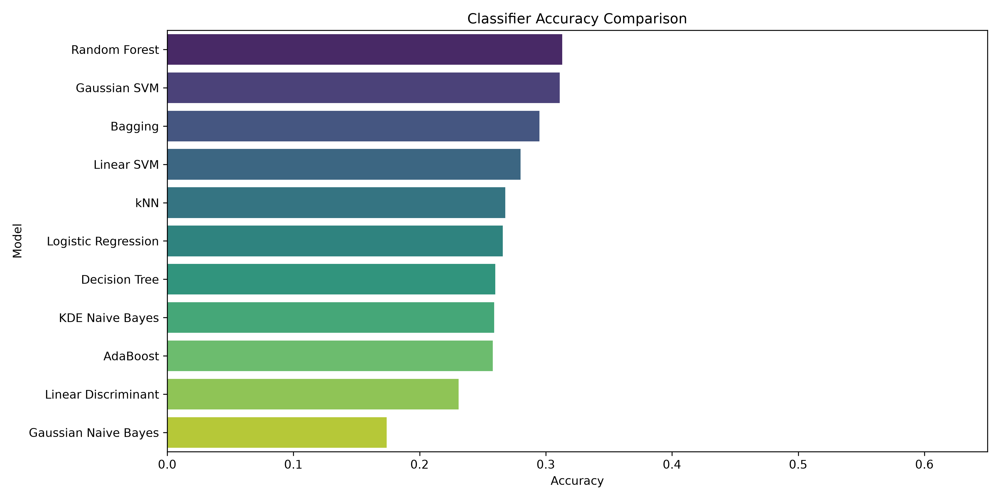
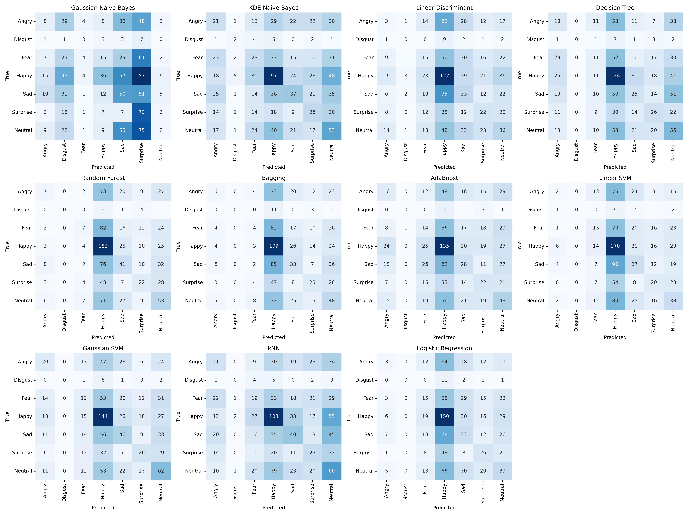
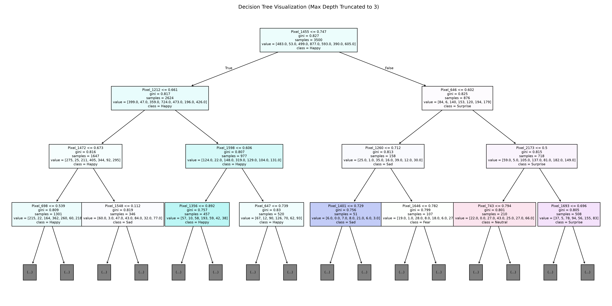
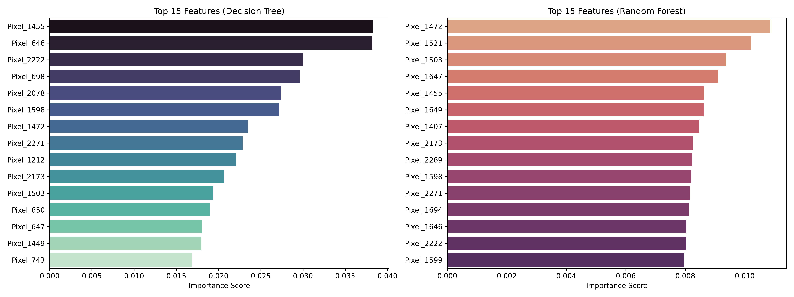
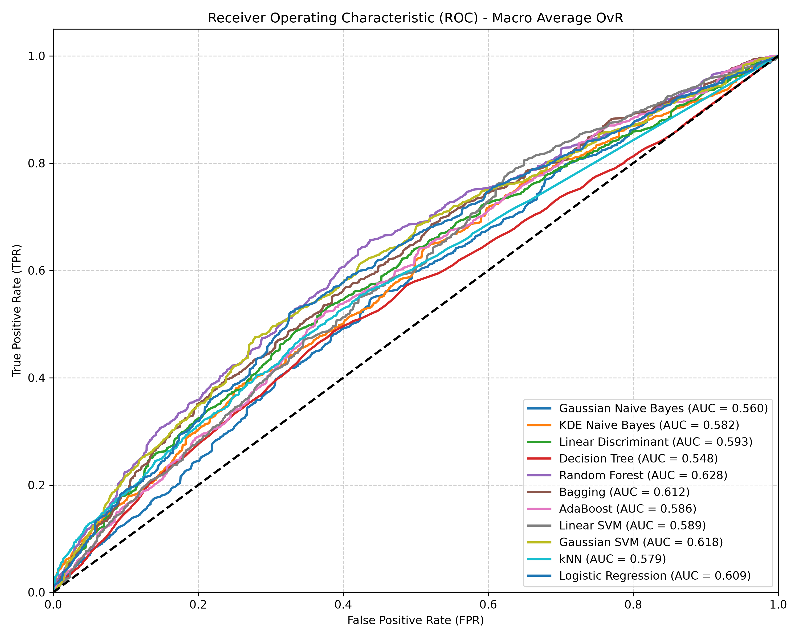
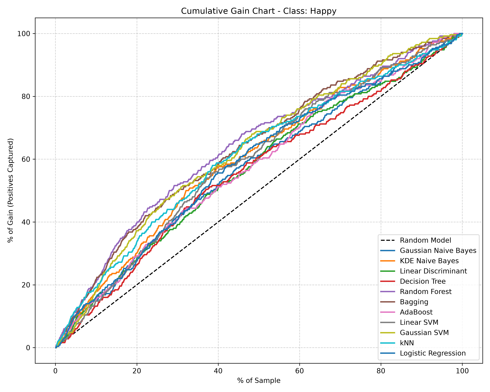
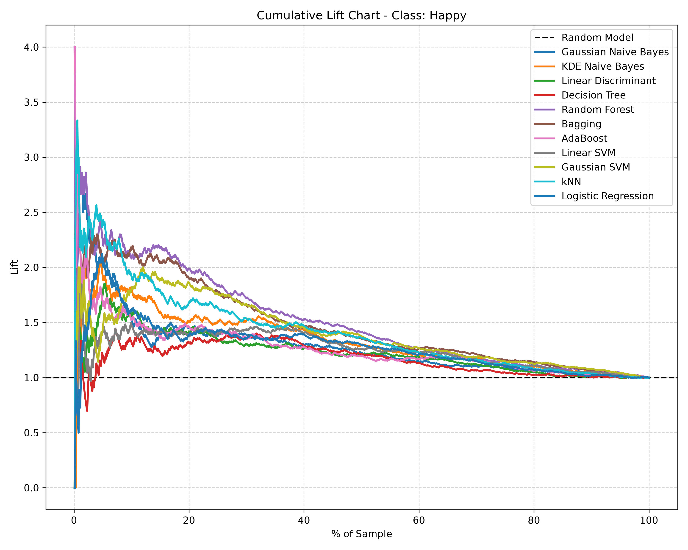
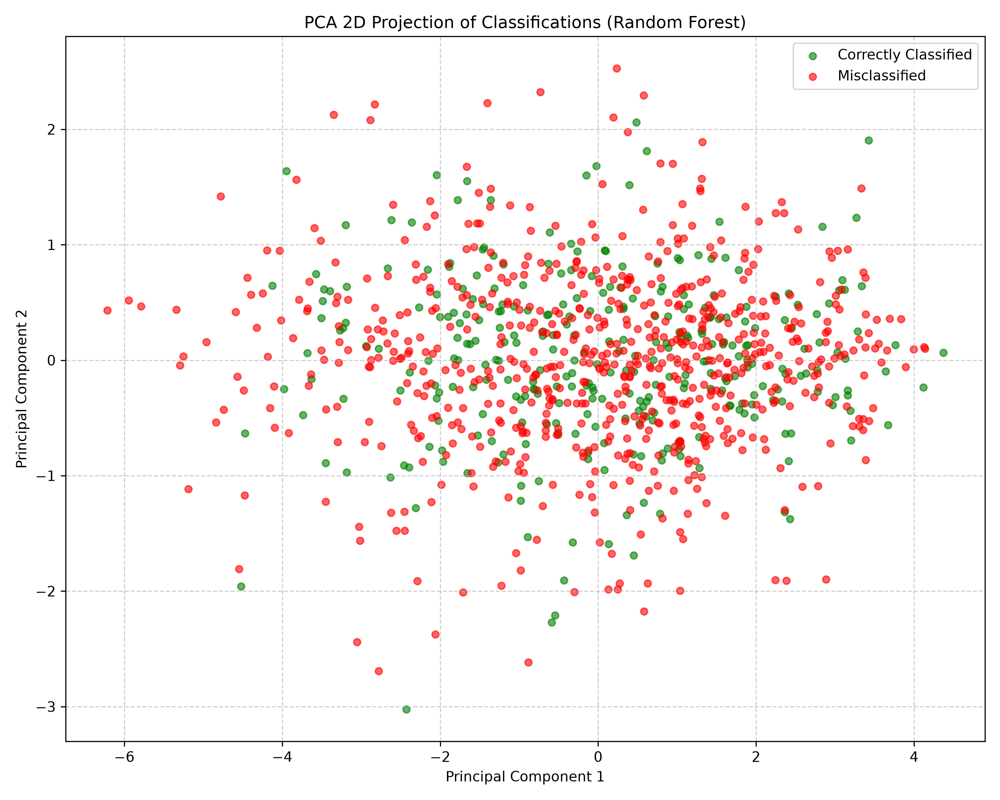

# Prezentare Proiect: Clasificare pe Setul de Date FER2013

Acest document reprezintă prezentarea finală a proiectului de Recunoaștere a Expresiilor Faciale (FER) realizat pe baza cerințelor din secțiunea **B. Clasificare** din [CerinteProiecte.pdf](file:///Users/mihai/Documents/ase-ml/CerinteProiecte.pdf).

---

## 1. Sursa Datelor și Preprocesare
* **Set de date**: FER2013 (Facial Expression Recognition 2013) descărcat de pe Kaggle.
* **Format**: Imagini alb-negru de dimensiune 48x48 pixeli (reprezentate ca vectori de 2304 de intensități de gri, valori în intervalul 0-255).
* **Clase (7 emotii)**: `Angry`, `Disgust`, `Fear`, `Happy`, `Sad`, `Surprise`, `Neutral`.
* **Preprocesare**:
  1. Împărțirea setului de date în subseturi reprezentative: set de antrenare (3500 instanțe), set de testare (1000 instanțe) și set de aplicare (500 instanțe).
  2. Normalizarea intensităților pixelilor prin împărțire la `255.0` (intervalul `[0, 1]`) pentru a asigura o convergență rapidă și stabilă a algoritmilor sensibili la scalare (SVM, Regresie Logistică).

---

## 2. Filtrarea Predictorilor (Feature Selection)
Pentru a reduce dimensiunea spațiului de intrare și a elimina zgomotul (de exemplu, pixeli de fundal neschimbați):
* S-a aplicat un filtru `VarianceThreshold(threshold=0.01)` pentru eliminarea pixelilor cu varianță redusă.
* S-a utilizat metoda statistică `SelectKBest` cu testul ANOVA F-test (`f_classif`) pentru a selecta cei mai predictivi **150 de pixeli**.

### Top 15 Predictori Selectați (ANOVA F-Score)
| Rang | Pixel Index | ANOVA Score | p-value | Status |
|---|---|---|---|---|
| 1.0 | 1503 | 30.59 | 5.52e-36 | Kept |
| 2.0 | 1455 | 30.10 | 2.20e-35 | Kept |
| 3.0 | 1454 | 29.01 | 4.58e-34 | Kept |
| 4.0 | 1407 | 29.00 | 4.75e-34 | Kept |
| 5.0 | 1501 | 28.49 | 1.97e-33 | Kept |
| 6.0 | 1551 | 28.49 | 1.98e-33 | Kept |
| 7.0 | 1502 | 28.41 | 2.46e-33 | Kept |
| 8.0 | 1504 | 28.21 | 4.30e-33 | Kept |
| 9.0 | 1550 | 28.14 | 5.23e-33 | Kept |
| 10.0 | 1259 | 28.13 | 5.44e-33 | Kept |
| 11.0 | 1408 | 28.03 | 7.17e-33 | Kept |
| 12.0 | 1549 | 27.89 | 1.06e-32 | Kept |
| 13.0 | 1212 | 27.84 | 1.21e-32 | Kept |
| 14.0 | 1598 | 27.81 | 1.29e-32 | Kept |
| 15.0 | 1452 | 27.62 | 2.25e-32 | Kept |

---

## 3. Performanța Modelelor
Au fost antrenați și comparați toți cei **11 algoritmi** specificați în cerințe. Rezultatele pe setul de testare sunt următoarele (ordonate descrescător după acuratețe):

| Model | Acuratețe | Precision (Macro) | Recall (Macro) | F1-Score (Macro) |
|---|---|---|---|---|
| **Random Forest** | **31.30%** | 24.51% | 22.53% | 20.33% |
| **Gaussian SVM** | **31.10%** | 23.98% | 23.92% | **23.16%** |
| **Bagging** | 29.50% | 21.87% | 21.19% | 18.72% |
| **Linear SVM** | 28.00% | 19.86% | 20.04% | 17.95% |
| **kNN** | 26.80% | 21.30% | 21.48% | 21.08% |
| **Logistic Regression** | 26.60% | 19.02% | 19.71% | 18.06% |
| **Decision Tree** | 26.00% | 19.66% | 20.10% | 19.15% |
| **KDE Naive Bayes** | 25.90% | 23.05% | 22.74% | 22.69% |
| **AdaBoost** | 25.80% | 19.08% | 19.49% | 18.72% |
| **Linear Discriminant** | 23.10% | 16.26% | 17.35% | 16.33% |
| **Gaussian Naive Bayes** | 17.40% | 18.39% | 17.94% | 12.90% |

### Grafic Comparativ Acuratețe

---

## 4. Matrice de Confuzie
Graficul de mai jos ilustrează matricele de confuzie pentru toate cele 11 modele antrenate. Această vizualizare relevă faptul că clasa `Happy` (expresia de fericire) este cea mai bine detectată, în timp ce emotiile negative (precum `Disgust` și `Fear`) sunt frecvent confundate între ele din cauza similitudinii trăsăturilor faciale.

---

## 5. Structura Arborelui de Decizie
Arborele de decizie a fost vizualizat și limitat grafic la o adâncime de 3 pentru lizibilitate.

---

## 6. Importanța Atributelor
Graficele de mai jos arată primii 15 pixeli critici identificați de **Decision Tree** și **Random Forest** pe baza scăderii impurității Gini.

---

## 7. Grafice de Robustețe
Pentru evaluarea completă a performanței și a capacității de discriminare a modelelor, s-au trasat curbele de robustețe:

### Curba ROC (Receiver Operating Characteristic) - Macro-average One-vs-Rest
Aceasta arată rata de adevărat pozitivi față de rata de fals pozitivi pentru toate cele 11 modele. **Gaussian SVM** și **Random Forest** au obținut cea mai mare valoare macro-AUC.

### Curbele de Gain și Lift (Clasa: Happy)
Pentru a evalua performanța pe clasa majoritară `Happy`, s-au generat diagramele cumulative de Gain și Lift.
Gain indică procentul de fețe vesele detectate în funcție de procentul din eșantionul analizat. Lift-ul arată eficiența fiecărui model față de o alegere pur aleatorie.

| Gain Chart | Lift Chart |
|---|---|
|  |  |

---

## 8. Proiecție PCA 2D a Erorilor de Clasificare
Folosind **Random Forest** (cel mai bun model ca acuratețe), am proiectat caracteristicile setului de testare în primele 2 componente principale (PCA) pentru a ilustra distribuția predicțiilor corecte (verde) și a celor greșite (roșu).

Distribuția relevă o suprapunere mare a punctelor în spațiul 2D, ceea ce explică acuratețea generală modestă a modelelor clasice în comparație cu rețelele neuronale profunde (CNN) pe date de pixeli brute.

---

## 9. Predicția pe Setul de Aplicare
Modelul **Random Forest** a fost aplicat pe setul de aplicare (500 instanțe separate). Acuratețea obținută pe setul de aplicare este de **28.80%**. 

Predicțiile detaliate au fost exportate în fișierul [predictions_aplicare.csv](results/predictions_aplicare.csv).
